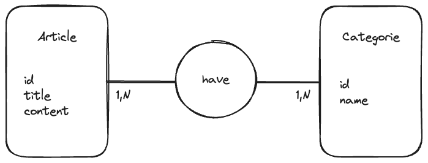

<h1 align="center">Bienvenue sur express-ts 👋</h1>
<p>
  
  <a href="#" target="_blank">
    
  </a>
  <a href="https://twitter.com/Gorski_anthony" target="_blank">
    
  </a>
</p>

> Un projet pour démarrer un serveur express en TypeScript

## 🚀 Installation

## Les dépendances

Nous avons besoin de typescript bien sûr pour la compilation de notre code.
ts-node-dev pour lancer notre serveur en mode watch et les types de node pour les types de node.

```sh
npm install typescript ts-node-dev @types/node --save-dev
```

Nous avons l'habitude de faire un `npm install express` et de l'utiliser en vanilla, mais en TS, nous avons besoin de plus de choses. Les types par exemple.

```sh
npm install express
npm install -D @types/express
```

## ⚙️ Configuration de TS

```sh
npx tsc --init
```

Nous allons ajouter une ligne dans le fichier `tsconfig.json` pour dire à TS de compiler en mode module.

```json
{
	"outDir": "./dist",
	"rootDir": "./src"
}
```

## 📝 Scripts

```json
"scripts": {
  "start": "ts-node-dev src/index.ts"
}
```

## ↗️ Utilisation

```sh
npm start
```

## 🚀 Build

### Update du script start

```json
"scripts": {
  "start": "node dist/index.js",
  "build": "tsc",
  "dev": "ts-node-dev --respawn src/index.ts"
}
```

## 🗄️ ORM Prisma

### Installation

Nous allons nous servir de Prisma pour gérer notre base de données.

La documentation : [Prisma](https://www.prisma.io/docs/getting-started/setup-prisma/start-from-scratch/relational-databases-typescript-mysql)

```sh
npm install -D prisma
```

On verifie si tout va bien avec la commande:

```sh
npx prisma -v
```

Ensuite, on va setup prisma avec la commande:

```sh
npx prisma init
```

Cette commande permet de créer un dossier `prisma` avec un fichier `schema.prisma` à la racine de notre projet ainsi qu'un fichier `.env` (si celui-ci n'existe pas). Du coup, nous devons installer `dotenv` pour gérer les variables d'environnement.

```sh
npm install dotenv
```

### Configuration de Prisma

Nous devons faire quelques modifications dans le fichier `schema.prisma` pour le configurer. Comme sur la [documentation](https://www.prisma.io/docs/getting-started/setup-prisma/start-from-scratch/relational-databases/connect-your-database-typescript-mysql)

```prisma
datasource db {
  provider = "mysql"
  url      = env("DATABASE_URL")
}
```

### Merise

Nous allons partir de ce modèle pour notre base de données.



Pourquoi avons nous besoins de ce modèle ⬆️ ?

Tout simplement car nous en avons besoin pour générer nos modèles avec Prisma. #PasDeHasard

### Création des models

Nous allons créer nos models en fonction de notre modèle conceptuel de données.

<details>
<summary>📁 models</summary>

```prisma
model Article {
  id       Int         @id @default(autoincrement())
  title    String
  content  String       @db.Text
  categories    Category[]  @relation("have")
}

model Category {
  id       Int         @id @default(autoincrement())
  name     String
  articles    Article[]  @relation("have")
}
```

</details>

Une fois que c'est fait, nous allons créer nos migrations avec la commande:

```sh
npx prisma migrate dev --name init
```

Et voilà 🎉 !


## Pas trop vite

Et oui, nous avons effectivement oublié le reste, c'est à dire nos routes, nos controllers et nos models.

Mais avant, si on suit toujours la documentation, nous devons installer `@prisma/client`.

```sh
npm install @prisma/client
```

Mais à quoi ça sert 🤔 ? A ça !


> C'est surtout pour accéder à la bdd, la sécurité, la performance.

> En résumé, **`@prisma/client`** est essentiel pour utiliser Prisma de manière efficace et sécurisée.

Une fois téléchargé, nous allons créer un fichier `prisma.ts` dans le dossier `services`.

## Auteur

👤 **Anthony Gorski**

-   𝕏 - (Twitter): [@Gorski_Anthony](https://twitter.com/Gorski_Anthony)
-   GitHub: [@GorskiAnthony](https://github.com/GorskiAnthony)

## Affichez votre soutien

## Donnez un ⭐️ si ce projet vous a aidé !

### 🗃️ Version

-   **v1.0.0** - First commit

---

### 👋 Qui suis-je ?

Je suis **Anthony Gorski**, développeur web et formateur à la [Wild Code School](https://www.wildcodeschool.com/fr-FR).

```

```

```

```
